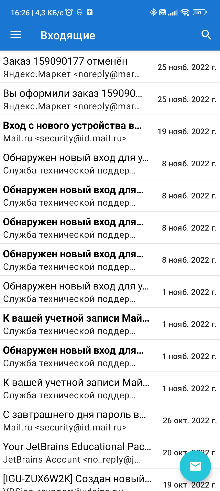
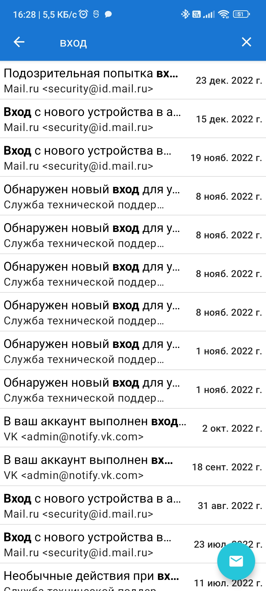
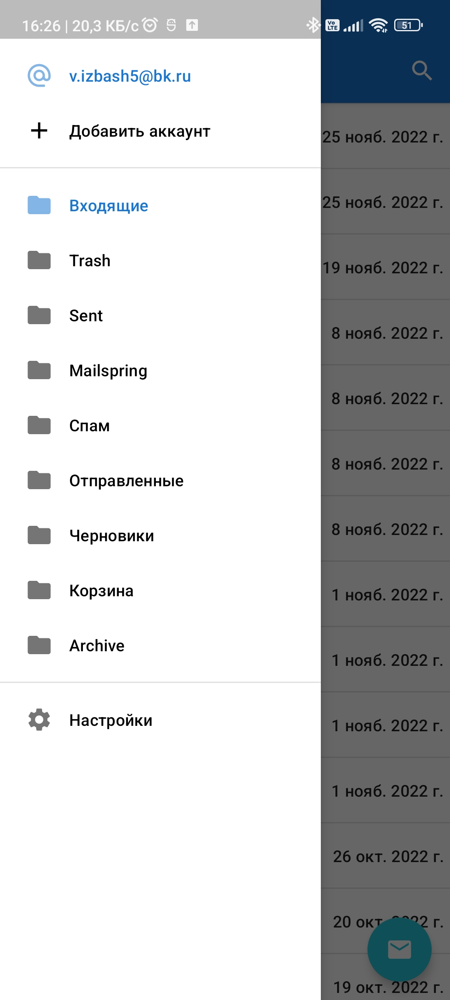
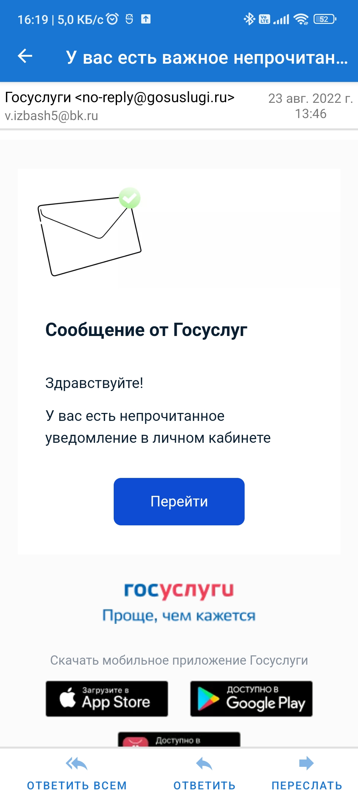
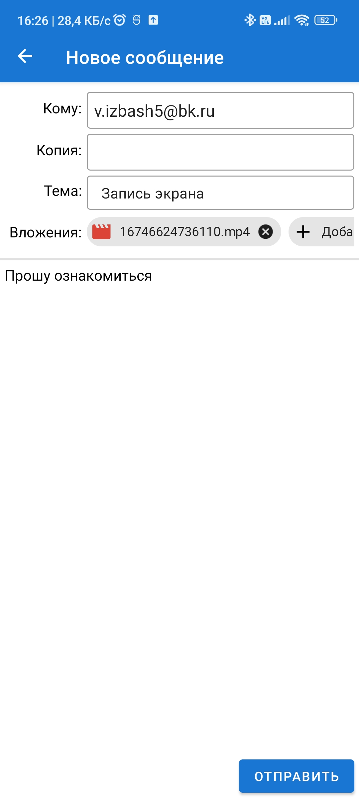

# Paramail
Мобильный почтовый клиент, работающий с IMAP и SMTP.

## Функционал
* управление почтовыми аккаунтами;
* просмотр писем выбранной папки в почтовом ящике;
* поиск по письмам;
* просмотр текстовых и html писем и загрузка вложений;
* отправка письма (reply и forward);
* оповещения о новых письмах.

## Скриншоты

## TODO
* добавление аккаунтов через oauth2;
* редактирование и удаление аккаунтов.
